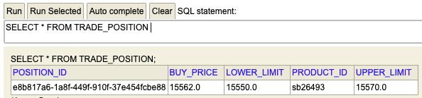

# BUX Assignment - Ronan Sammon

This trading bot is designed to open a trade given a set of upper and lower limits. Once the upper or lower limit is 
reached, the position will be automatically closed. The trade can be configured in the spring boot config file using
the following properties:

- The product you wish to trade:
bux.product.id=sb26493

- The amount of the above product:
bux.trade.buy.amount=100

- The upper limit at which you will sell at a profit:
bux.trade.upper.limit=15551
  
- The lower limit at which you will sell at a loss:
bux.trade.lower.limit=15540

When a position is opened, its information is stored in a h2 in memory database. The primary key is the
positionId which we receive back from BUX when opening a trade, this is later used to close the said trade.

This can be viewed at the following url:
http://localhost:8080/h2-console/

-To run from the command line use: **mvn spring-boot:run**

**The *master-refactored* branch was created as I was doing some refactoring at the weekend while 
the markets were closed and I was having issues using the local bux-server (which was working for 
me previously). As I wasn't actually able to verify my refactored code against BUX servers, I left 
it on another branch**